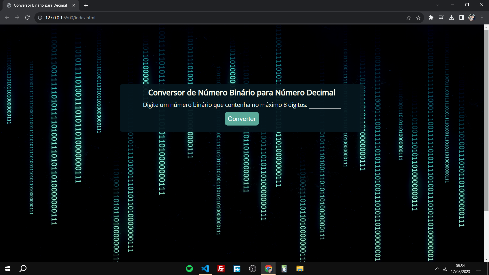

<h1 align="center"> Conversor de Binário para Decimal </h1>

Este projeto é apenas um de vários outros projetos que estão disponíveis para se insipirar na comunidade do Fiasco no Discord. 
<a href="https://discord.com/channels/1118646437085970472/1119454144294551593/threads/1119456763536740502">Estude esse projeto ou outros projetos clicando aqui.</a>

  <a href="#-tecnologias">Tecnologias</a>&nbsp;&nbsp;&nbsp;|&nbsp;&nbsp;&nbsp;
  <a href="#-projeto">Projeto</a>&nbsp;&nbsp;&nbsp;|&nbsp;&nbsp;&nbsp;
  <a href="#-layout">Layout</a>&nbsp;&nbsp;&nbsp;|&nbsp;&nbsp;&nbsp;
  <a href="#memo-licença">Licença</a>

 

  

## 🚀 Tecnologias

Esse projeto foi desenvolvido com as seguintes tecnologias:

- HTML e CSS
- JavaScript
- Git e Github

## 💻 Projeto

O BIN2DEC é um conversor de número binário para número decimal.

- [Acesse o projeto finalizado, online](https://lucasdecarvalho-dev.github.io/Bin2Dec)

---

Feito com ♥ by Lucas de Carvalho